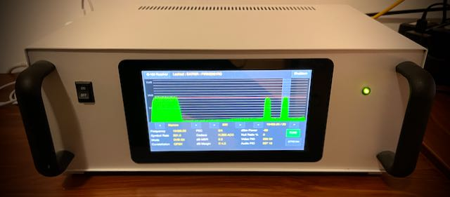

# Q-100 Receiver

Control and monitor a DATV receiver with a touch screen.



$${\color{red}WARNING:\space ALL\space DEVELOPMENT\space TAKES\space PLACE\space ON\space THE\space MAIN\space BRANCH}$$

## Hardware
- Raspberry Pi 4B with 4GB RAM (minimum)
- Raspberry Pi Official 7" Touch Screen
- BATC MiniTiouner v2.0

**A keyboard and mouse are not required at any time**
## Connections
TODO: add more details and photos
## Installing
NOTE: CURRENTLY REQUIRES PI OS BOOKWORM DESKTOP 64-BIT

### Using Raspberry Pi Imager v1.8.5:
```
Select Raspberry Pi 4 and Raspberry Pi OS (64-bit)

CONFIGURE:
	Set hostname:			rxtouch
	Enable SSH
		Use password authentication
	Set username and password
		Username:			pi
		Password: 			<password>
	Set locale settings
		Time zone:			<Europe/Madrid> # or wherever you are
		Keyboard layout:	<us>
	Eject media when finished
SAVE and WRITE
```

Insert the card into the Raspberry Pi and switch on

WARNING: the Pi may reboot during the install, so please allow it to complete

### Remote login from a Mac, PC or Linux host
```
ssh pi@rxtouch.local

sudo apt install git
mkdir /home/pi/Q100
cd /home/pi/Q100
git clone https://github.com/ea7kir/q100receiver-bookworm.git

chmod +x /home/pi/Q100/q100receiver-bookworm/etc/install.sh
/home/pi/Q100/q100receiver-bookworm/etc/install.sh
```

THEN FOLLOW THE INSTRUCTIONS AND CONFIGURE THE DESKTOP

## License
Copyright (c) 2023 Michael Naylor EA7KIR (https://michaelnaylor.es)

This program is free software: you can redistribute it and/or modify it under the terms of the GNU General Public License as published by the Free Software Foundation, either version 3 of the License, or (at your option) any later version.

This program is distributed in the hope that it will be useful, but WITHOUT ANY WARRANTY; without even the implied warranty of MERCHANTABILITY or FITNESS FOR A PARTICULAR PURPOSE. See the GNU General Public License for more details.

You should have received a copy of the GNU General Public License along with this program. If not, see https://www.gnu.org/licenses/.


[def]: doc/rx.jpeg